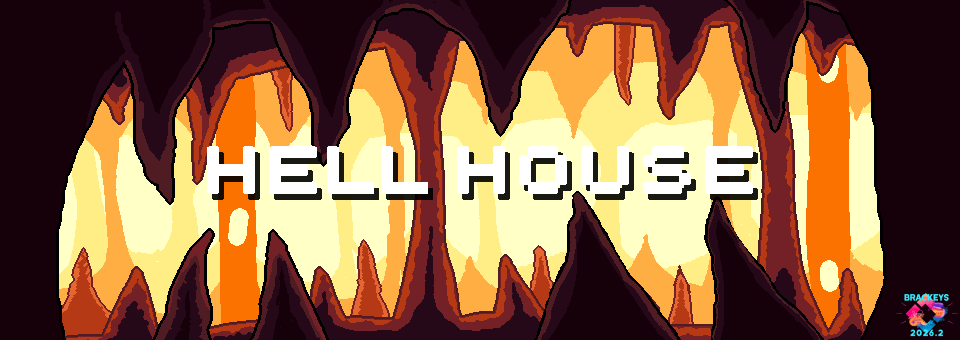
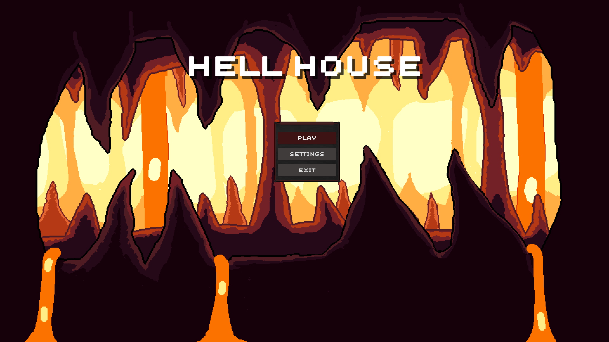
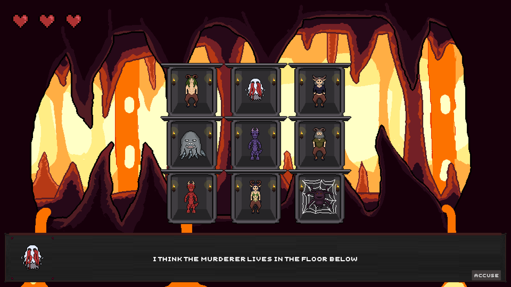

# Hell House

**A puzzle game from hell.**

*Build as part of [Brackeys Game Jam 2026.2](https://itch.io/jam/brackeys-16).*

## Description

Hell House is a murder mistery game in hell.

interrogate the residents and find the murderer!

you can accuse anybody, but be careful, they will strike back, if you accused wrong.

## Screenshots

*Title Screen*

*3x3 Level*

## Credits

Art - [Miriana](https://www.youtube.com/@MirianaGames)
Development & Sound Design - [Max Jöhnk](https://maxjoehnk.me)

## Assets

* [Super Dialogue Audio Pack](https://dillonbecker.itch.io/sdap) by [Dillon Becker](https://www.dillonbecker.com/)
* [400 Sounds Pack](https://ci.itch.io/400-sounds-pack)
* [UI User Interface Mega Pack](https://toffeecraft.itch.io/ui-user-interface-mega-pack)
* [Scary Ambient Sounds](https://frederikbertelsen.itch.io/scary-ambient-sounds)
* [Sound Effects - Survival 1](https://darkworldaudio.itch.io/sound-effects-survival-i)
* [Unscreen MK](https://www.dafont.com/unscreen-mk.font) by [Manfred Klein](http://manfred-klein.ina-mar.com)
